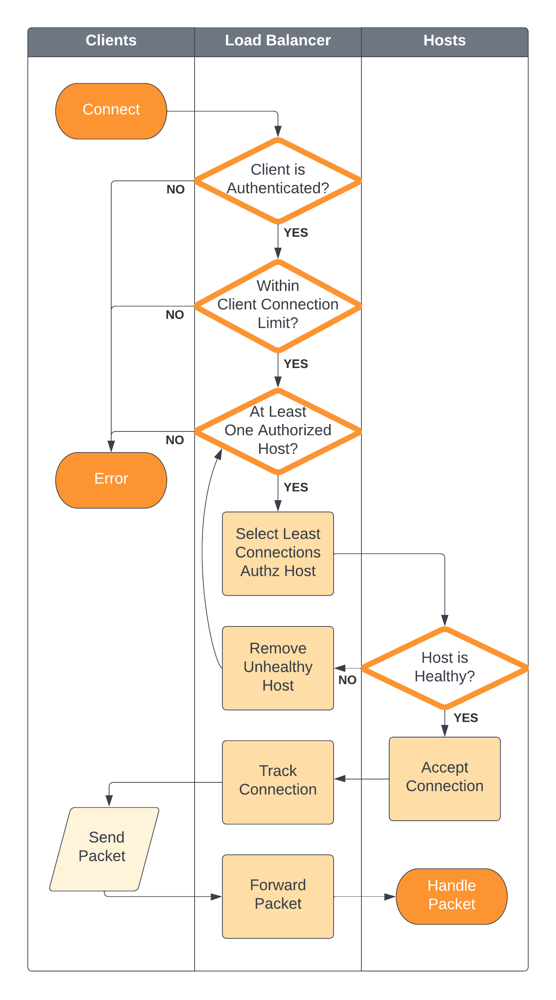

# tcp-load-balancer

A basic TCP load balancer with least connection forwarding. 

Currently only implements requirement 1 and 6 from the following requirements pulled from the [gravitational career challenge](https://github.com/gravitational/careers/blob/rjones/challenge-2.md/challenges/systems/challenge-2.md). Additional requirements will be added soon.
1. **Implement a least connections request forwarder that tracks the number of connections per upstream.**
2. Implement a per-client connection rate limiter that tracks the number of client connections.
3. Implement a health checking request forwarder that removes unhealthy upstreams.
4. Use mTLS authentication to have the server verify identity of the client and client of the server.
5. Develop a simple authorization scheme that defines what upstreams are available to which clients; this scheme can be statically defined in code.
6. **Accept and forward requests to upstreams.**

## Quick Start

Everything you need to run this app on your machine is listed below.

#### Requirements
* go.1.18

#### Instructions
Use `go run main.go -p 50043` to start the load balancer and have it listen on port `50043`. 

If no port is supplied, an an available port will be selected.
## Testing

#### Unit Tests
Run `go test ./...` to start unit tests.

#### Local Debugging
Start the load balancer with `go run main.go -p 50043`, and then watching the logs as the statically configured clients begin sending data to the static hosts, via the LB. 

Additionally you may open a tcp connection using a command like `telnet localhost 50043` to send data through the load balancer. Exit the telnet prompt with `Ctrl + ]` and then type `quit`.

## How it Works

The following diagram offers a simplified overview of the required steps (currently or soon to be implemented) taken by the load balancer. It provides a quick view of the process from when a client initiates connection to when the data is passed to the upstream host. Each "swimlane" at the top of the diagram indicates which entity performs the action. See the [project design doc](rfd/001-tcp-load-balancer-design-doc.md) for more details on the planned implementation of each step.

